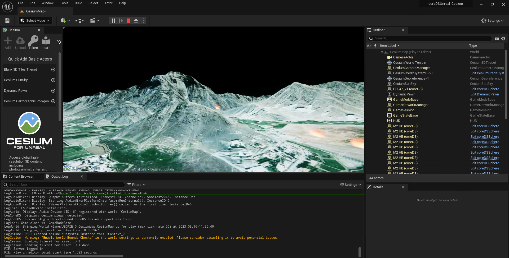
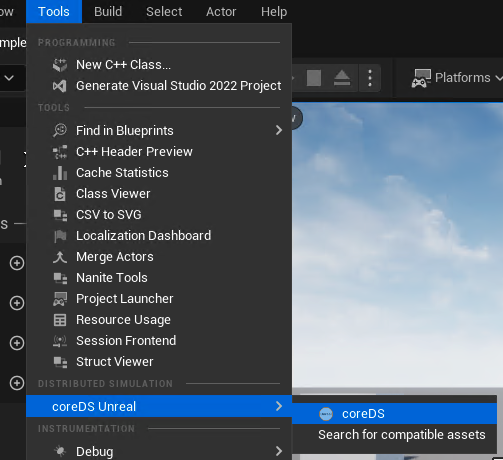
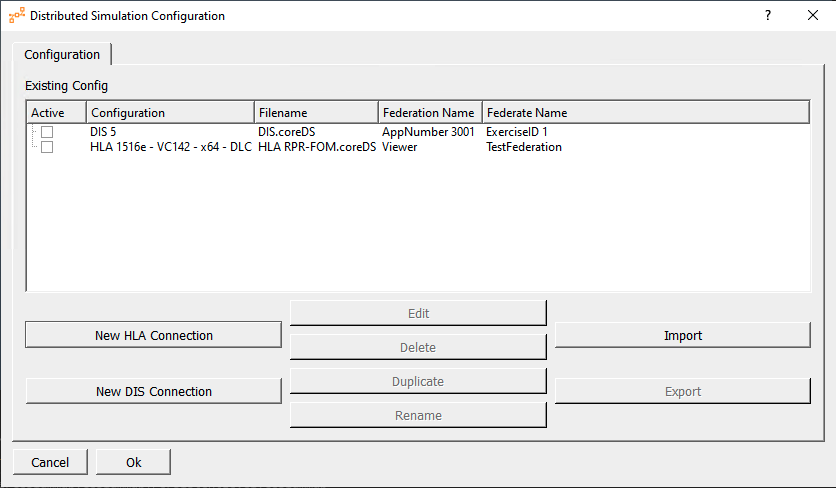

# coreDS Unreal AutomaticMode with Cesium integration
This is a Sample project to be used with coreDS Unreal and Unreal Engine 5. You can request a [free trial](https://www.ds.tools/contact-us/trial-request/).

coreDS Unreal must already be installed and activated in order to use this project. Please make sure the coreDS Unreal plugin is enabled.

The [Cesium Unreal plugin](https://cesium.com/platform/cesium-for-unreal/) must also be installed and activated.

This sample showcases the Automatic Object Management mode on top of the coreDS Unreal automatic georeferencing system detection to discover the Cesium plugin and automatically process the coordinate system correctly.

The Automatic Mode manages the complete life-cycle of discovered objects allowing an easy to receive information from DIS or HLA. You can add receive and send DIS/HLA objects within a few minutes.

For the sake of simplicity, all objects will be shown as orange balls.

Please refer to the [AutomaticMode Sample](https://github.com/distributedsimulationtools/coreUnrealAutomaticMode) to learn more about controlling the mapping between EntityKind and the actor to be spawned.

This sample project uses the following coreDS concepts:

* Connect
* Disconnect
* Receive Update Object (Receive EntityStatePDU or UpdateAttributeValues)
* Delete Objects (EntityStatePDU timeout or RemoveObjectInstance)

The sample is already configured. Next chapter goes over the various steps required to start from scratch.

## Getting started
The first step is to configure coreDS Unreal to enable the Automatic Mode.

You can find that configuration from Edit->Project Settings->coreDS Unreal

Note the "UniqueIdentifier" field. We will come back to this later. For now, please note this field is a regex string. When the "UniqueIdentier" matches, the corresponding object is spawned. The first valid match will be used so you have to be careful to place your higher priority match at the beginning.

For each object, you can enable/disable collisions and physics. We recommend leaving the collision and physics disabled at first and enabling them afterwards when you can confirm the objects are spawned correctly.

In this particular example, all objects will be shown as orange balls

The Cesium world will automatically zoom to the location of the first discovered entity. This is done via a Level Blueprint. 

To make that happen, we register a "Object Update Handler" to receive updates to the "AutomaticMode" object. "AutomaticMode" is a built-in object type defined by coreDS Unreal. Once an update is received, we "fly to location" of the received object and set a variable to prevent that move from happening again.

The complete object life cycle is managed by coreDS Unreal. Connect and disconnect will also be taken care of automatically.

coreDS Unreal supports dead reckoning (DR) and is enabled for this project. You can disable it from the Plugin configuration window by checking the "Enable Dead reckoning” box.

In order for DR to work properly, it must first be activated and the DR properties must be correctly mapped (see below)

The next step is to configure an actual connection with a Distributed Simulation protocol. coreDS supports HLA (High-Level Architecture)and DIS (Distributed Interaction Simulation).

You can open the configuration window either by running the game or by clicking on the coreDS toolbar button.

This sample comes with 2 preconfigured configuration files.

Let's take a look at each configuration.

(Directly jump to the  [HLA configuration](#hla))

## Distributed Interactive Simulation (DIS)

For both configurations, it is important to configure the Configured Network Adapter. Click on the drop box and select your active Network Adapter.

Even if DIS does not explicitly support subscriptions, coreDS supports incoming filtering. First, we must let coreDS know that we want to receive the EntityStatePDU. We must subscribe to "EntityState".

Receiving
Then comes the mapping configuration. Since we are in a receiver, we care about the "Mapping In"

The first step is to Map a Local Object to a Protocol Object. As you see, an "Automatic Object" object is listed in the "+" list. You can then link the "Automatic Object" to "Entity State PDU".

Then you must map the local properties to the protocol properties. Since we are in a receiving mode, we only care about the values we are interested in. When using the Automatic Mode, it is really important to set a "UniqueIdentifier". The "UniqueIdentifier" can be anything meaning you could assign it to Marking to discriminate based on the object name. In most cases, we use the EntityType. To do so, set an "On Data Received" script to "EntityType". You can select the script "UseAsUniqueIdentifier.lua".

Dead Reckoning
If DR is enabled, you must map the DR properties correctly like this:

Finally, we must set the other parameters.

At this point, you are done. Depending on your plugin configuration, each time an EntityStatePdu is received, a new object will be spawned and its complete lifecycle will be handled by coreDS Unreal.

## High-Level Architecture (HLA)
For both configurations, it is important to configure the connection to the correct RTI.

coreDS-based products support a wide variety of RTI, HLA versions and binding type. It is important to select the correct RTI Settings combination. Although coreDS will try to inform you, at runtime, if the selected combination is invalid, this is not a failsafe process. An incorrect combination can lead to an unexpected crash. Do not hesitate to contact if you are unsure about your configuration.

### Publication and Subscription

In this particular sample, we published/subscribed to 

HLAobjectRoot.BaseEntity.PhysicalEntity, EntityType and Spatial

### Federate Parameters

The Federate parameters pane contains all the information required to create, join and configure a connection to the RTI.

Receiving
Then comes the mapping configuration. Since we are in a receiver, we care about the "Mapping In"

The first step is to Map a Local Object to a Protocol Object. As you see, an "Automatic Object" is listed in the "+" list. You can then link the "Automatic Object" to "HLAobjectRoot.BaseEntity.PhysicalEntity".

Then you must map the local properties to the protocol properties. Since we are in a receiving mode, we only care about the values we are interested in. In our case, we want to send back to Unreal the Location and the Orientation. When using the Automatic Mode, it is really important to set a "UniqueIdentifier". The "UniqueIdentifier" can be anything meaning you could assign it to Marking to discriminate based on the object name. In most cases, we use the EntityType. To do so, set an "On Data Received" script to "EntityType". You can select the script "UseAsUniqueIdentifier.lua".

Dead Reckoning
If DR is enabled, you must map the DR properties correctly like this:

At this point, you are done. Depending on your plugin configuration, each time a PhysicalEntity is received, a new object will be spawned and its complete lifecycle will be handled by coreDS Unreal.
